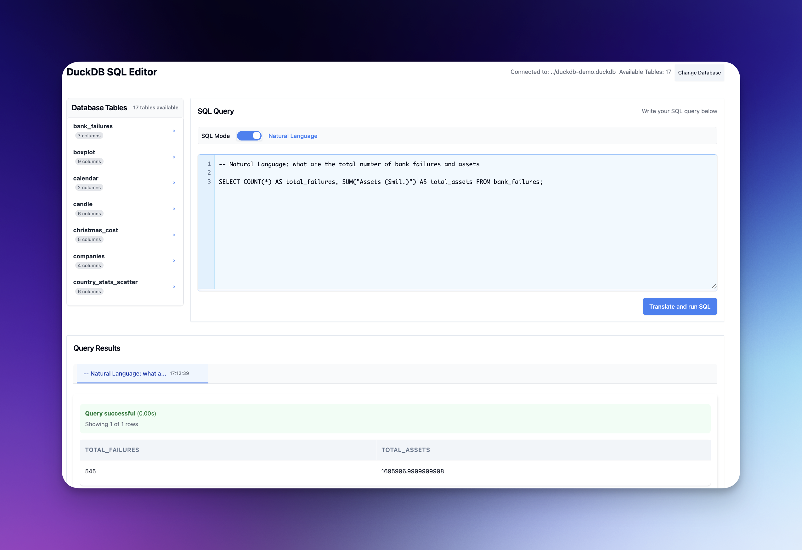

# DuckDB SQL Editor

A powerful interactive SQL editor for DuckDB databases with a modern web interface built using FastHTML and MonsterUI components.



## Features

- **Connect to DuckDB Databases**: Easily connect to any DuckDB database file
- **Interactive SQL Editor**: Write and execute SQL queries with syntax highlighting
- **Table Explorer**: Browse tables and view their schemas
- **JSON Browsing**: Explore and navigate JSON data with an interactive tree viewer
- **Query Results**: View query results in a formatted table with pagination
- **Natural Language to SQL**: Translate natural language queries to SQL using OpenAI (optional)
- **Modern UI**: Clean, responsive interface built with MonsterUI components

## Quick Start

This project uses Poetry for dependency management. Make sure you have Python 3.10+ and Poetry installed.

```bash
# Clone the repository
git clone https://github.com/yourusername/duckdb-sql-editor.git
cd monsterui-sql-editor-duckdb

# Install dependencies
poetry install

# Copy and configure environment variables
cp duckdb-sql-editor/.env.example duckdb-sql-editor/.env

# Run the application
cd duckdb-sql-editor
poetry run python app.py
```

Then open your browser and navigate to http://127.0.0.1:5002 (or the port specified in your .env file).

## Configuration

Edit the `.env.example` file in the `duckdb-sql-editor` directory with your settings:

```
# Default path to the example DuckDB database file
DUCKDB_PATH=../duckdb-demo.duckdb
OPENAI_API_KEY=your-openai-api-key  # Optional for natural language to SQL feature

# Server configuration
HOST=127.0.0.1
PORT=5002
```

## Demo Database

The repository includes a sample DuckDB database (`duckdb-demo.duckdb`) with example data for demonstration purposes.

## Usage

1. **Connect to a Database**: The application connects to the database specified in your `.env` file
2. **Browse Tables**: The sidebar shows all available tables in the database
3. **View Table Schema**: Click on a table name to see its structure and sample data
4. **Write Queries**: Use the SQL editor to write your queries
5. **Execute Queries**: Click the "Run" button to execute the current query
6. **Explore JSON Data**: View and navigate JSON columns with the interactive tree viewer
7. **Natural Language**: Use the "AI Query" feature to convert natural language to SQL (requires OpenAI API key)

## Development

This project is structured as follows:

- `duckdb-sql-editor/app.py`: Main application file with all routes and logic
- `duckdb-sql-editor/.env`: Configuration file (not tracked in git)
- `duckdb-demo.duckdb`: Demo database file

## Technologies Used

- [Python 3.10+](https://www.python.org/)
- [FastHTML](https://www.fastht.ml/) - Modern web framework in pure Python
- [MonsterUI](https://github.com/AnswerDotAI/MonsterUI) - UI component library for FastHTML
- [DuckDB](https://duckdb.org/) - Embeddable SQL OLAP database
- [Poetry](https://python-poetry.org/) - Dependency management

## Requirements

- Python 3.10 or higher
- Poetry for dependency management
- Modern web browser

## License

MIT 